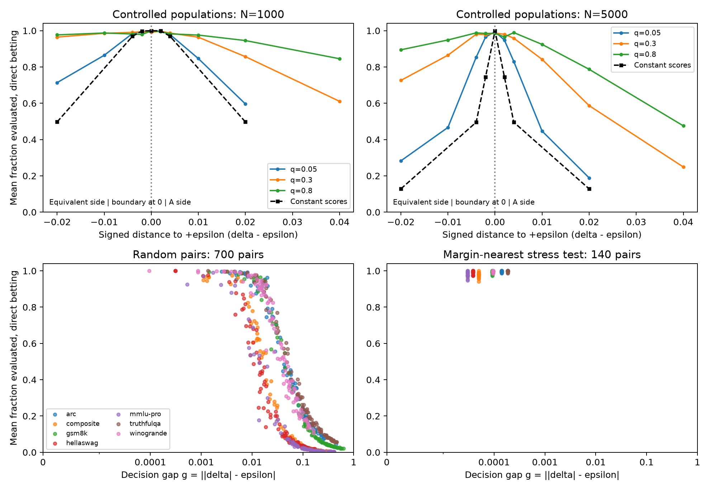
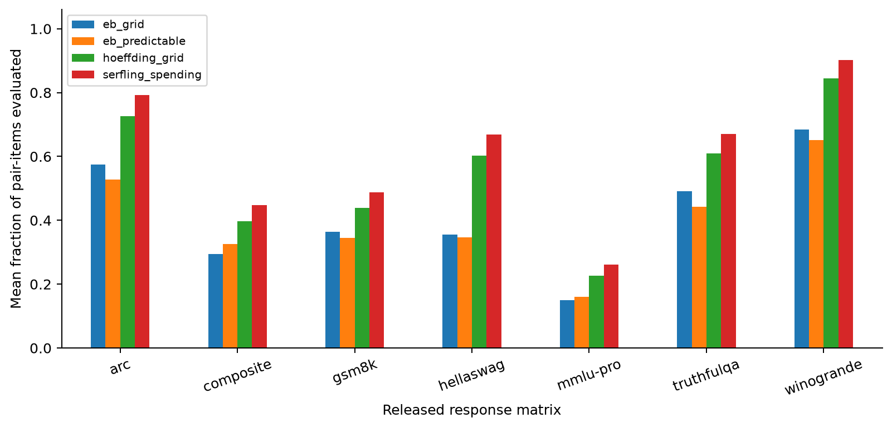
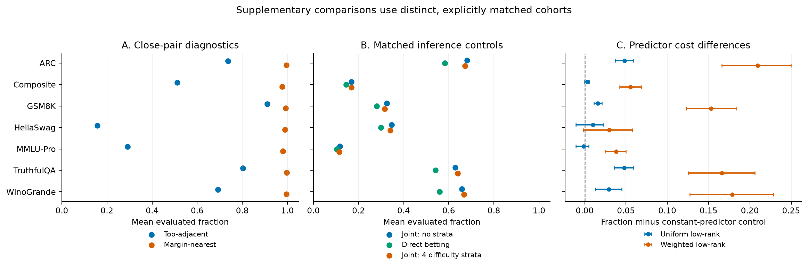
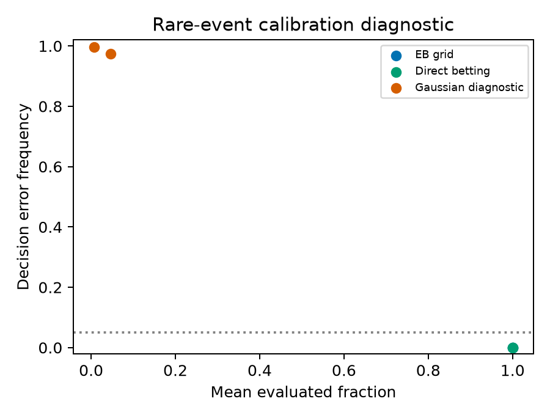

# The Cost of Certifying Near-Boundary Model Comparisons on Finite Benchmarks

**English Markdown manuscript for human review, revised 10 September 2026. Not submitted.** Author names and affiliations remain to be supplied.

## Abstract

Comparing two models on a fixed benchmark can end with practical superiority or equivalence, but certifying that decision may require nearly every item. We characterize this cost through distance to the practical decision boundary and the changes still possible in unseen scores. For any uniformly alpha-correct adaptive procedure, a coupling argument bounds the probability of leaving a label-changing set unqueried. Its edit-capacity consequence forces at least (1-2alpha)M expected queries when each of M coordinates can individually change the correct label. A standard concentration bound gives a sufficient early-stopping regime farther from the boundary; the two bounds describe different scales and are not matching. Controlled replays show that the near-census region widens with paired disagreement, while constant populations remain costly at the boundary despite zero variance. Existing replays from seven public response matrices place these findings in context: 700 random pairs exhibit heterogeneous costs, whereas 140 retrospectively selected margin-nearest pairs require 97.7–99.7% of items on average across matrices with direct betting. These stress-test costs demonstrate difficult available comparisons, not their prevalence or the optimality of the evaluator. The resulting account separates an unavoidable obstruction at fine boundary resolution from the broader, method-dependent cost observed in benchmarks.

## 1. Introduction

The difficult model comparison need not be the pair with the smallest performance difference. If differences up to two percentage points are practically equivalent, a difference near zero lies inside a decision region; a difference near two points lies on its edge. Early-stopping cost should therefore be studied against distance to that edge, rather than summarized only over arbitrary model pairs.

We ask: **when can certified model comparison stop substantially early, and when is the remaining uncertainty about unseen items fundamentally consequential?** We condition on a fixed finite benchmark and fixed paired scores, so randomness comes from the evaluation design. A correct decision means practical superiority beyond a predeclared margin or affirmative equivalence within it.

Sequential equivalence and without-replacement confidence sequences supply the inferential tools [1,2]. Sequential model evaluation already studies stopping cost [3], and election and financial audits certify assertions about fixed finite populations [18–20]. Building on this literature, we separate the query cost imposed by label-changing alternatives from the cost of a chosen inference procedure.

The main theoretical result extends the finite-vector inclusion argument to nonconstant near-boundary populations through their available coordinate changes. It recovers a near-census lower bound at one-item resolution. A standard concentration argument supplies an explicit upper bound away from the boundary. The necessary and sufficient bounds operate at different scales. The main empirical result is a boundary-dependent cost landscape, with substantial differences between low- and high-variance populations at the same gap. Figure 1 places controlled populations beside both random public pairs and a deliberately difficult cohort. The theory establishes an obstruction when few unseen changes can alter the label; the replays measure how much of the benchmark specific certified procedures actually inspect. Their agreement is qualitative outside the resolution covered by the lower bound.

## 2. Related work

**Finite-population inference.** Waudby-Smith and Ramdas provide bounded and categorical confidence sequences for sampling without replacement [1]. Their composite-null inversion already permits decisions about regions of the mean. Spertus, Sridhar, and Stark study sequential stratified inference, including adaptive interleaving and stronger union-intersection constructions [4].

**Sequential model comparison.** Arviv et al. combine group-sequential testing with pairwise comparison and equivalence margins [3]. Their stated calibration uses approximate normality, independent observations, and planned looks. We instead condition on the realized finite score vector and use non-asymptotic design-based guarantees. SySRs exploits paired observations and model similarity in fixed-budget best-model identification [5]. PULSE combines finite-pool inference, adaptive model allocation, and low-rank predictions [6]. Their objectives differ from certifying a three-region decision; fixed-budget accuracy cannot be compared to a stopping guarantee without an explicit adaptation.

**Prediction-assisted and adaptive evaluation.** CELEUS supplies anytime-valid finite-pool inference from surrogate-completed, inverse-probability-corrected signals [7]. It is a close general framework in which paired differences can be treated as a bounded outcome. Hsu and Shekhar study active confidence-sequence construction using historical model responses, with a target defined through per-question success probabilities [8]. Their analysis already highlights cases where uniform querying competes favorably with adaptive querying. Bayesian coreset sizing, including multi-target modeling, is developed by BayesAME [9].

**Measurement and uncertainty.** ATLAS uses IRT and Fisher information for adaptive ability estimation [10]; Jiang et al. examine reliability of IRT estimation in AI benchmark regimes [11]. Balkır et al. extend adaptive ranking to continuous scores and cost-aware pairwise stopping [12]. Neuhof and Benjamini emphasize subject heterogeneity and the importance of selecting the inferential population [13]. We do not extrapolate fixed-matrix results to new subjects. Pilditch studies Bayesian precision and stability stopping, including repeated attempts [14]. AV-AIVAT combines variance reduction and confidence sequences for agent evaluation in games [15]. tinyBenchmarks is an important earlier example of efficient item selection and score reconstruction [16].

**Sequential auditing beyond model evaluation.** Kato and Nakagawa [18] construct finite-population binary audit tests with hypergeometric recursion, prespecified looks and controlled errors outside an indifference region. Unlike affirmative equivalence here, their indifference region imposes no decision-error restriction. Their review also traces hypergeometric sequential testing to Lai (1979) and subsequent closed multistage procedures. RiLACS [19] uses confidence sequences to certify election assertions, continuing to a full count when necessary. Its mean-threshold reduction is closely related to each directional certificate used here. Risk-limiting financial audits [20] already combine weighted WoR sampling, bounded-value confidence sequences and side information. Thus fixed-population certification, full-count fallback and prediction-assisted sampling have substantial antecedents outside LLM evaluation.

**Closest cost and lower-bound comparisons.** Arviv et al. already plot evaluation cost against performance difference; studying difficulty-dependent cost is therefore not itself new. Their current author code (commit `2c44ed23d2a8df2b42a036c9dc639bb71c0c07d5`) implements efficacy by exclusion of zero and equivalence by containment in the margin. Those conditions can both hold. Our mutually exclusive practical-superiority labels instead use the outer thresholds ±epsilon. A numerical head-to-head using the original stop reasons would consequently score different claims. The main comparisons therefore use inference constructions with the same three labels. Harmonizing an original pipeline is possible, but requires changing its stopping target and checking its calibration; target mismatch is a reason not to compare raw stop reasons, not evidence that our evaluator is cheaper.

Shekhar and Ramdas [17] derive instance-dependent lower bounds for fixed-sample WoR CI widths in a moderate-accuracy regime. Their Theorem 3.4 and discussion of time-uniform extensions are directly relevant prior art. Our coupling result concerns adaptive query cost for a label-changing finite-vector alternative, including fixed-alpha endpoint cases; it does not replace their richer width lower bounds or establish a general optimal rate. The edit-capacity argument specializes a standard two-instance indistinguishability principle to query cost. Its role is to expose which unseen changes obstruct this decision, rather than introduce a new general lower-bound method.

## 3. Problem formulation

For items i=1,...,N, let a_i,b_i be fixed scores in [0,1] and d_i=a_i-b_i. The target is delta=N^{-1} sum_i d_i. Fix epsilon in [0,1) before observing the target responses. Define A when delta>epsilon, E when -epsilon<=delta<=epsilon, and B when delta<-epsilon. Thus A and B mean *practical superiority*, rather than merely a positive or negative difference.

Evaluating an item reveals both scores. We count pair-items and, when both responses must be generated, twice as many model calls. Algorithms may choose an unseen item using past observations and pre-existing metadata. They must return the correct label with probability at least 1-alpha for every admissible fixed vector. The probability is over the sampling design. At census the label is known exactly. Before census an unresolved result remains unresolved.

This target excludes generation uncertainty. A cached stochastic response is treated as the fixed response being audited, not an estimate of its model's success probability. It also excludes sampling new subjects, new questions, or new prompt templates. The item-weighted target used here may differ from a leaderboard's mean-of-task-means convention. The public matrices include upstream filtering and are not described as complete official benchmark releases.

Define the **decision gap** g=||delta|-epsilon|. It is the distance to the nearest practical decision boundary, not the distance to zero. In particular, two almost equal models may be easy to certify as equivalent when epsilon is appreciable, whereas a difference almost equal to epsilon can be difficult. Gap is used to describe outcomes after a replay, never supplied to the stopping algorithm.

## 4. Methods

### 4.1 Confidence-sequence decisions

Let C_t=[L_t,U_t] be an anytime-valid confidence sequence for delta. Stop with A if L_t>epsilon, with B if U_t<-epsilon, and with E if C_t is contained in [-epsilon,epsilon]. Empty intersections produce no certificate. Otherwise continue, or at census compute the exact mean. On the simultaneous coverage event, every certified decision is correct. Consequently the probability of any wrong final label is at most alpha; a separate correction for three labels is unnecessary.

We apply the existing finite-population constructions to X=(d+1)/2. At step t, with R_t=N-t+1 and previously observed sum S_{t-1}, its conditional mean is (N mu-S_{t-1})/R_t. The empirical-Bernstein exponential factors use predictable estimates of the next observation and psi(lambda)=-log(1-lambda)-lambda. Appendix A gives the full construction and proof.

The grid variant intersects eight constant-bet confidence sequences, with bets .01, .025, .05, .1, .2, .4, .6, .8 and a Bonferroni allocation across bets and signs. The predictable variant follows the variance-sensitive schedule described in the implementation. Both intersect earlier intervals and the deterministic bounded-completion interval. These choices were fixed before examining real-data results.

### 4.2 Comparators and follow-up betting tests

The initial certified comparators are the empirical-Bernstein variants, a Hoeffding bet grid, and fixed-look Hoeffding–Serfling bounds with spending over geometric checkpoints. A deterministic completion rule and full census provide assumption-light references. Separate-arm empirical-Bernstein intervals, with alpha split between the two models, isolate the benefit of pairing.

Repeated normal intervals are included as an explicitly uncertified diagnostic, using finite-population variance correction and a minimum of 20 observations. Fixed-budget plug-in classifiers at 10%, 25%, and 50% of the benchmark are also uncertified and reported separately. Their lower costs do not establish an advantage under equal validity requirements.

After the initial experiment, we added direct mixtures of standard linear betting factors for the four directional threshold hypotheses at ±epsilon. Each directional test receives alpha/2. For any one true label, at most two rejection events can cause a wrong decision, yielding an overall alpha guarantee. This follow-up is an adaptation of established betting inference, not an independently novel method. It uses the same pair cohorts and replay seeds as the initial methods.

### 4.3 Evidence used for the central comparison

Direct betting and EB-grid use identical frozen populations and replay permutations, with the same practical labels and error guarantee. Figure 1 shows the direct-betting cost landscape; EB-grid and other certified baselines provide method sensitivity in Appendix C. A planned Gaussian calibration diagnostic is documented separately in Appendix D. Stratification, surrogate and low-rank analyses are also supplementary.

## 5. Theory: a boundary obstruction and an early-stopping regime

### 5.1 Information in unseen coordinates

**Theorem 1 (inclusion constraint).** For any uniformly alpha-correct algorithm, alpha<1/2, two admissible finite score vectors with different correct labels that differ only on J imply P(query at least one item in J)>=1-2alpha under either vector. The algorithm may choose unseen items adaptively, but the two worlds must have identical external side information.

**Proof.** Couple their internal randomness. Until J is queried their histories coincide. A shared terminal history avoiding J produces the same output in both worlds, wrong in at least one. Its probability is at most the sum of the two error probabilities. Complete consequences and cost variants are proved in Appendix A.

This is an indistinguishability argument, not a new confidence-sequence construction. It expresses why a stable observed prefix cannot exclude an unseen label-changing item.

### 5.2 From exact boundaries to nonconstant near-boundary populations

At delta=epsilon, increasing any coordinate with d_i<1 changes equivalence to practical superiority, if that change remains admissible. For known positive costs c_i,

E[cost] >= (1-2alpha) sum_{i:d_i<1} c_i.

Thus a constant vector d_i=epsilon requires at least .9N expected evaluations at alpha=.05, despite zero variance. For ternary paired scores at that boundary with disagreement q, the bound is .9N[1-(q+epsilon)/2]. These are necessary costs, not predictions of a particular algorithm's exact stopping time.

**Theorem 2 (edit-capacity and gap).** Choose the direction through a nearest boundary toward a different label. Let a_i be the maximum change of coordinate i in that direction (1-d_i for increasing, 1+d_i for decreasing). For h>0 define I_h={i:a_i>=h}, M=|I_h|, and k=floor(Ng/h)+1. If k<=M and every endpoint replacement of a k-subset of I_h is admissible, then

E[|Q intersect I_h|] >= (M-k+1)[1-(2alpha)^(1/k)].

In particular, g<h/N implies E tau >=(1-2alpha)M. The bound applies to nonconstant vectors on either side of either boundary. For unequal costs it also yields min_{i in I_h} c_i times the displayed bound; the singleton form above can be stronger. Appendix A proves the result by averaging Theorem 1 over k-subsets and applying a convex hypergeometric bound. The previous homogeneous hidden-exception bound is a special case.

Holding the admissible capacity set fixed, decreasing g strengthens this obstruction stepwise. Changing populations also changes their capacity sets and sampling information: the theorem does not imply that gap alone orders all stopping costs. This is an elementary consequence of the inclusion constraint; it provides a necessary cost rather than an optimal stopping rule.

### 5.3 When early certification is sufficient

There is also a distribution-free positive statement. Let L=log(2N/alpha) and

t_0=min{N, floor[8L(N+1)/(Ng^2+8L)]+1}.

For g>0, an all-look Hoeffding–Serfling procedure with alpha/N spending obeys P(tau<=t_0)>=1-alpha and E tau<=t_0+alpha(N-t_0). Its radius r_t=sqrt{2[1-(t-1)/N]L/t} is simultaneous; on coverage, the CI certifies once 2r_t<g. Appendix A gives the derivation. This is a conservative existence result using established concentration, not an optimized bound for our betting implementation.

Hence Ng^2 much larger than log(N/alpha) is sufficient for a small high-probability evaluation fraction, while capacity-rich populations with Ng<h face a large unavoidable fraction. The gap between these sufficient and necessary regimes is substantial. A variance-based approximation suggests a crossover controlled partly by Ng^2/variance, but we neither prove that collapse nor claim a sharp phase transition. Zero-variance and high-disagreement populations show why a single universal gap curve would be misleading.

## 6. Boundary-focused experiments

### 6.1 Reproducible design

The initial simulation uses 69 fixed populations, 1,000 independently seeded random permutations per population, and six methods: 414,000 method-runs. Population sizes are 200, 1,000, and 5,000. Ternary disagreement rates and signed differences vary independently where feasible. Additional settings vary alpha and the equivalence margin, and include constant equivalence, constant boundary, and a single changed item. Integer rounding can make two nominal settings represent the same population at small N; results retain the actual finite mean and no artificial distinction is claimed.

The public study uses seven released complete response matrices. Each contributes 100 disjoint randomly selected model pairs and 30 permutations per pair. Three margins are evaluated for the six initial methods; separate-arm and fixed-budget ablations use the main .02 margin. These produce 462,000 method/margin-runs, not that many distinct model pairs. Model-pair selection does not use observed performance gaps. All raw archives, processed matrices, exclusions, and seeds are recorded.

| Matrix | Test models | Items | Source release |
|---|---:|---:|---|
| ARC | 417 | 844 | ATLAS |
| GSM8K | 420 | 1,306 | ATLAS |
| HellaSwag | 386 | 5,711 | ATLAS |
| TruthfulQA | 516 | 644 | ATLAS |
| WinoGrande | 521 | 1,045 | ATLAS |
| MMLU-Pro | 2,213 | 12,032 | efficiently-evaluating-llms |
| Multi-task composite | 2,212 | 9,574 | efficiently-evaluating-llms |

No test rows were removed for missing responses. This does not undo upstream filtering. Historical difficulty uses disjoint IDs, but family separation is not guaranteed. The exploratory stratification study uses the first 20 preselected pairs and five independent permutations per matrix; favorable/unfavorable heterogeneity simulations use 300 repetitions per setting.

We report decision error separately from entire-path CS miscoverage. Stratified coverage logging currently stops with the decision and is not called a full-path audit. Exact binomial intervals are supplied per fixed simulation population. For real-data cost uncertainty, pairs are bootstrap clusters; repeated permutations are not treated as independent model draws. These cohort intervals are descriptive and do not establish representativeness of future models.

### 6.2 Controlled boundary sweep

We add 74 fixed populations: N in {1000,5000}, ternary disagreement q in {.05,.3,.8}, and means .02 plus feasible offsets in {-.02,-.01,-.004,-.002,0,.002,.004,.01,.02,.04}; seven constant-score populations per N; and one rare-event diagnostic per N. Every configuration receives 300 random permutations and three methods (66,600 replays). Counts are rounded before sampling and the actual finite mean is recorded. No gap is supplied to an evaluator. This follow-up design was chosen after the original study and is exploratory.

For N=5000 and g=.002 on the equivalent side, direct betting evaluates .965 of items at q=.05, .978 at q=.3 and .985 at q=.8. At g=.02, the corresponding fractions at delta=0 are .282, .726 and .895. Constant populations instead use .128 at g=.02, .745 at g=.002, and exactly 1 at g=0. Thus cost concentrates near the boundary, but neither gap nor zero observed variance alone determines an adequate budget. Small reversals in the empirical curves and differences across q rule out claiming strict monotonicity from this sweep. We observe a crossover, not evidence of a universal sharp phase transition or a fitted asymptotic law.

**Figure 1. Boundary distance and certification cost.** Top: controlled populations, with mean cost over 300 permutations and signed distance to the positive boundary; q is paired disagreement. Bottom: existing public-data replays, with one point per pair and color identifying the matrix. Random pairs (700 points, 30 permutations each) and margin-nearest stress pairs (140 points, 100 permutations each) are shown separately on identical axes. The public-data horizontal axis is g=||delta|-epsilon|, using a logarithmic scale above 0.00001 and a linear segment containing zero. Both sides of either practical boundary are pooled in these descriptive scatterplots. They show pair means, not independent draws from a population of future models. All panels use direct betting at alpha=.05 and epsilon=.02; no fitted universal cost curve is implied. The plotted public-pair table is `results/boundary_figure_pairs.csv`.

### 6.3 Public-data stress test and broad-cohort context

The existing retrospective margin-nearest cohort selects 20 pairs per matrix with absolute full-matrix difference closest to .02, then uses 100 independent permutations. EB-grid requires .9974–.9999 of items across matrices; direct betting requires .9766–.9974. These estimates are conditional on deliberately difficult selected pairs, not random-model prevalence estimates. The top-adjacent cohort is less uniformly difficult: direct betting ranges from .157 to .910. Being close in rank does not imply being close to a practical decision boundary.

For context, the original 700 random-pair cohort gives an EB-grid macro-average fraction .41635; direct betting is cheaper in every matrix. That average is not the principal result and its full table is in Appendix C. Selection by gap is diagnostic, not a deployable oracle policy: evaluators see only revealed prefixes, while the full matrix defines the retrospective analysis strata.

### 6.4 What the theory and replays jointly establish

The experiments and lower bound answer different questions. The lower bound applies to every uniformly correct algorithm when the stipulated label-changing alternatives remain admissible. The experiments measure particular betting and confidence-sequence procedures on particular vectors. High observed cost beyond the one-item regime can reflect both statistical difficulty and conservative inference; these runs do not identify the optimal cost. Public stress pairs demonstrate that difficult comparisons occur in the released matrices, while the separate random cohort prevents interpreting that selection as a prevalence estimate. The planned Gaussian diagnostic in Appendix D concerns calibration and does not supply evidence for the near-boundary cost claim.

## 7. Limitations

The theory links decision gap, coordinate edit capacity and necessary cost through an elementary coupling argument. The lower and upper bounds are not matching and leave the variance-sensitive intermediate regime unresolved. Consequently, observed near-census stopping times are not established to be optimal. Side information that rules out the constructed alternatives can also remove the stated obstruction.

The public matrices contain upstream filtering, older model families and dependent model lineages. Margin-nearest selection deliberately enriches difficult pairs and cannot estimate their prevalence. We use item-weighted frozen scores, not official macro-weighted leaderboard targets, future generations or new-task performance. Unequal-cost evidence is synthetic; no dollar savings are established.

Our strongest empirical comparisons are common-target replays of explicit inference constructions. Arviv's efficacy target differs from our practical-superiority target, so an original-pipeline comparison requires an explicit adaptation and calibration check. Predictors and strata in Appendix C are adaptations, not an exhaustive comparison against every configuration of CELEUS or PULSE. No state-of-the-art cost claim follows. This missing harmonized comparison limits conclusions about relative efficiency, even though it does not affect the validity of the inclusion bound.

## 8. Conclusion

Certified comparison can stop early when the evidence separates the finite mean from the relevant practical boundaries. At one-item resolution, many admissible unseen coordinates can each change the answer, forcing substantial evaluation even without observed variation. Between those regimes, disagreement, edit capacity and inference design matter; distance alone does not determine cost. The theory establishes the fine-resolution obstruction, and public-data replays show its practical counterpart: selected boundary-close comparisons can consume almost the whole benchmark. Quantifying the optimal cost throughout the intervening regime remains open.

## References

1. Ian Waudby-Smith and Aaditya Ramdas. *Confidence Sequences for Sampling Without Replacement*. NeurIPS 2020. [arXiv:2006.04347](https://arxiv.org/abs/2006.04347).
2. Christopher Jennison and Bruce W. Turnbull. *Sequential equivalence testing and repeated confidence intervals, with applications to normal and binary responses*. Biometrics 49(1), 1993. [Institutional record](https://researchportal.bath.ac.uk/en/publications/sequential-equivalence-testing-and-repeated-confidence-intervals-/).
3. Ofir Arviv et al. *Stop Guessing When to Stop Testing: Efficient Model Evaluation with Just Enough Data*. 2026. [arXiv:2607.08522](https://arxiv.org/abs/2607.08522).
4. Jacob V. Spertus, Mayuri Sridhar, and Philip B. Stark. *Sequential stratified inference for the mean*. Version 3, 2026; initial preprint 2024. [arXiv:2409.06680](https://arxiv.org/abs/2409.06680).
5. Zifan Lyu et al. *Cutting LLM Evaluation Costs with SySRs: A Bandit Algorithm that Provably Exploits Model Similarity*. 2026. [arXiv:2606.07726](https://arxiv.org/abs/2606.07726).
6. Elad Tolochinsky, Yaniv Tenzer, and Yaniv Romano. *Valid Best-Model Identification for LLM Evaluation via Low-Rank Factorization*. 2026. [arXiv:2605.10405](https://arxiv.org/abs/2605.10405).
7. Zhijian Zhou et al. *CELEUS: Certifiable and Efficient LLM Evaluation via E-Processes*. 2026. [arXiv:2606.20820](https://arxiv.org/abs/2606.20820).
8. Chia-Yu Hsu and Shubhanshu Shekhar. *Efficient Sequential Evaluation of Large Language Models*. 2026. [arXiv:2607.17409](https://arxiv.org/abs/2607.17409).
9. Paula Cordero Encinar et al. *BayesAME: Bayesian Active Model Evaluation*. 2026. [arXiv:2607.27023](https://arxiv.org/abs/2607.27023).
10. Peiyu Li et al. *Adaptive Testing for LLM Evaluation: A Psychometric Alternative to Static Benchmarks*. Version 3, 2026; initial preprint 2025. [arXiv:2511.04689](https://arxiv.org/abs/2511.04689).
11. Han Jiang, Sunbeom Kwon, Jinwen Luo, Ziang Xiao, and Susu Zhang. *Can We Trust Item Response Theory for AI Evaluation?* 2026. [arXiv:2607.15190](https://arxiv.org/abs/2607.15190).
12. Esma Balkır et al. *Confident Rankings with Fewer Items: Adaptive LLM Evaluation with Continuous Scores*. 2026. [arXiv:2601.13885](https://arxiv.org/abs/2601.13885).
13. Bitya Neuhof and Yuval Benjamini. *Quantifying Ranking Uncertainty in LLM Benchmarks*. 2026. [arXiv:2607.16259](https://arxiv.org/abs/2607.16259).
14. Toby D. Pilditch. *Knowing When to Stop: Bayesian Optimal Stopping for LLM Evaluations*. 2026. [arXiv:2608.14425](https://arxiv.org/abs/2608.14425).
15. Boning Li, Yu Chen, and Longbo Huang. *AV-AIVAT: 74× Cheaper Agent Evaluation with Certified Anytime-Valid Stopping in Imperfect-Information Games*. 2026. [arXiv:2608.06362](https://arxiv.org/abs/2608.06362).
16. Felipe Maia Polo, Lucas Weber, Leshem Choshen, Yuekai Sun, Gongjun Xu, and Mikhail Yurochkin. *tinyBenchmarks: evaluating LLMs with fewer examples*. ICML 2024. [arXiv:2402.14992](https://arxiv.org/abs/2402.14992).
17. Shubhanshu Shekhar and Aaditya Ramdas. *Tighter Confidence Intervals under Without Replacement Sampling via Empirical Rate Functions*. 2026. [arXiv:2603.14423v1](https://arxiv.org/html/2603.14423v1).

18. Masahiro Kato and Kei Nakagawa. *Sequential Audit Sampling for Finite Populations with Exact and Simulation-based Guarantee*. Version 2, August 2026. [arXiv:2604.06116v2](https://arxiv.org/html/2604.06116v2).
19. Ian Waudby-Smith, Philip B. Stark, and Aaditya Ramdas. *RiLACS: Risk-Limiting Audits via Confidence Sequences*. EVoteID 2021. [arXiv:2107.11323](https://arxiv.org/html/2107.11323v2).
20. Shubhanshu Shekhar, Ziyu Xu, Zachary Lipton, Pierre Liang, and Aaditya Ramdas. *Risk-limiting financial audits via weighted sampling without replacement*. UAI 2023, PMLR 216:1932–1941. [Proceedings](https://proceedings.mlr.press/v216/shekhar23a.html).

## Appendix A. Proofs and implementation definitions

The complete self-contained proofs, including the exponential-factor inequality, adaptive stratification validity, inclusion constraints, and hidden-exception bound, are in [THEORY.md](THEORY.md). That document is part of this manuscript and should be integrated verbatim into a submission export after review. Its proposition numbering is local to that appendix document.

## Appendix B. Reproduction and audit material

The locked initial design is [PROTOCOL.md](PROTOCOL.md), with deviations in [RESEARCH_LOG.md](RESEARCH_LOG.md). Implementations are in `src/finite_eval.py`; `tests/test_core.py` contains exact ternary-population enumerations, conditional-factor checks, prefix-measurability checks, and edge cases. `scripts/prepare_data.py` rebuilds processed matrices; `scripts/run_experiments.py` produces initial simulation, real-data, and stratification runs. `scripts/additional_experiments.py` and `scripts/betting_simulation.py` produce follow-up studies. `scripts/summarize.py` and `scripts/summarize_additional.py` regenerate tables and figures.

Full per-run outputs and per-cell summaries are retained locally in `results/`; the review archive includes summaries and scripts that regenerate the per-run records. Dataset counts, exclusions, and SHA-256 digests are in `data/processed/audit.json` and the archive manifests. The entry point `scripts/reproduce.py --full` rebuilds all experiments and reports individual subprocess outcomes. A separate standard-library audit checks 1,118,200 recorded outcomes for completeness and internal consistency, and recomputes selected headline figures from raw records. An independent target audit recomputes all 563,200 real-study means and labels from integer score totals and rational margins. Before this boundary-focused revision, a clean rebuild from source archives reproduced seven matrices and all 1,051,600 original replay records exactly in the recorded environment, and passed all 15 original unit tests. The two supplementary reporting checks also matched. The revision adds 66,600 replays, verified by a second execution with an identical SHA-256 digest, and three tests, bringing the passing total to 18. Those tests exhaustively check small-population edit alternatives, the sufficient-bound algebra, and an exact rare-event diagnostic. The revision repeat is not a new separate-directory clean rebuild; its narrower scope is recorded in `results/boundary_revision_audit.json`. These checks do not replace statistical proofs or establish external validity. See REPRODUCE.md and `results/clean_reproduction_comparison.json` for scope and evidence. No model API calls are required. The standalone `manuscript.md` is generated from the editable main text and complete theory appendix.

## Appendix C. Secondary mechanisms and broad-cohort context

These studies test sensitivity and retain adverse results. They are not the central novelty claim.

### C.1 Main real-data comparison

The table gives mean fractions of pair-items evaluated at alpha=.05 and epsilon=.02. Full census is 1.000 for every matrix. The betting column is the follow-up direct test; all other displayed methods were in the initial protocol.

| Matrix | EB grid | Predictable EB | Hoeffding grid | Serfling spending | Direct betting |
|---|---:|---:|---:|---:|---:|
| ARC | .575 | .528 | .727 | .793 | .481 |
| Composite | .294 | .326 | .398 | .447 | .261 |
| GSM8K | .365 | .346 | .439 | .488 | .310 |
| HellaSwag | .356 | .346 | .603 | .669 | .291 |
| MMLU-Pro | .149 | .160 | .227 | .261 | .129 |
| TruthfulQA | .491 | .443 | .610 | .671 | .411 |
| WinoGrande | .685 | .652 | .844 | .902 | .588 |

The EB-grid macro-average is .41635. It produces no observed errors across the 21,000 main-margin replays. Direct betting is cheaper in each matrix and produces 11 errors across the same 21,000 replays; this remains an empirical statement, not an assertion that its true risk is that pooled frequency. Its proven guarantee is .05 per frozen vector. Neither the grid nor predictable EB dominates the other across matrices. Therefore the EB grid should not be promoted as a superior new algorithm.

Equivalence-specific costs are much less favorable than the aggregate. For EB-grid, the mean evaluated fractions among equivalent pairs are .978 on ARC, .980 on GSM8K, .983 on TruthfulQA, and .960 on WinoGrande. They are lower on HellaSwag (.632), MMLU-Pro (.637), and the composite (.791). Large savings over a random pair cohort can conceal expensive equivalence decisions. No claim about close leading models follows from randomly selected pairs alone.

### C.2 Pairing and stratification

Separate-arm confidence sequences are more expensive than paired EB-grid in all seven main-margin matrices. This is an expected benefit of exploiting model correlation, already central to SySRs; it is not a new finding about pairing in general.

On the exploratory public-data cohort, simple combined-stratum intervals usually cost more than an unstratified EB-grid. For the composite, the mean ratio of stopping costs with 38 task strata is about 21.5. This statistic is the average of per-replay ratios, not the ratio of mean costs, and is amplified by very early unstratified decisions. It should not be interpreted as a universal multiplicative penalty.

Controlled simulations show that stratification can nevertheless help. With two opposite constant strata, it evaluates .341 of the population versus .982 without strata. With a large constant stratum and a small noisy stratum, estimated-Neyman allocation evaluates .400 versus .772 unstratified and .859 under proportional allocation. With homogeneous mixed strata, it is worse (.964 versus .898). These examples establish a contingent trade-off between within-stratum variance reduction, allocation, and simultaneous-inference overhead. They do not establish optimal adaptive allocation.

### C.3 Stronger joint stratified inference

The cost of combining separate stratum intervals is not intrinsic to stratification. We additionally implement joint union-intersection exponential tests, using the same fixed bet grid but optimizing the nuisance vector of stratum means over the global null and deterministic completion box. The optimization reduces to fractional knapsack. This is a specialization of established stratified inference, with a proof in THEORY.md Section 9; we do not claim a new general testing principle. Both proportional and estimated-Neyman allocations are predictable. Inspections occur every 16 items, with all evaluations charged.

On the same 20-pair, five-permutation cohort, 5,800 joint-stratified replays give no observed errors. For the composite's 38 task strata, mean evaluated fractions are .186 with proportional allocation and .545 with estimated-Neyman allocation, compared with .764 and .752 for the respective separate-interval procedures. The unstratified EB-grid fraction on this cohort is .172. Thus the large separate-interval penalty mostly disappears with a stronger inference construction, but these task strata still do not establish a savings advantage over the uniform comparator. Across all seven matrices and each tested stratum definition, proportional allocation is cheaper than estimated-Neyman allocation for this joint test. This is evidence about these allocations and test statistics, not an impossibility result for adaptive sampling. Independent linear-programming comparisons and exhaustive small-population checks supplement the mathematical proof.

Matched follow-up controls use the same pairs and seeds: a one-stratum version of the joint test with the same 16-item inspection schedule, and direct uniform-pair betting. They add 1,400 replays. The one-stratum joint mean fraction on the composite is .169, versus .186 for task-stratified proportional inference. Direct betting is .146 on that cohort and is cheaper than every tested joint-stratified configuration in all seven matrices. Consequently, the observed repair of the separate-interval penalty is not evidence that stratification beats a strong uniform comparator. The direct test inspects every item, so this last comparison includes different inspection schedules; the matched one-stratum joint control isolates that scheduling difference.

### C.4 Prediction, close pairs, and heterogeneous costs

We evaluate a CELEUS finite-pool signal adaptation on 30 preselected pairs per matrix and ten permutations, using 64 charged pilot pair-items to select nearest historical response profiles from 32 disjoint reference models. Uniform constant prediction, uniform historical prediction, and variance-weighted historical prediction share the same signal-based testing code. All sampling probabilities are accounted for in the signal; predictor accuracy is not needed for validity. This is not a reproduction of the authors' full predictor configuration. Across 6,300 replays, historical profiles usually increase cost. On HellaSwag, variance-weighted prediction reduces the mean fraction from .272 to .262; on ARC it increases it from .517 to .640. We report this negative predictor result without inferring that prediction assistance generally fails. Pilot and reference-model provenance are retained in the repository.

Random pairs are supplemented with two retrospectively selected cohorts: adjacent pairs among the top 21 released model rows, and the 20 pairs closest to the practical margin in absolute full-matrix mean difference. Each receives 100 permutations and two methods, giving 56,000 replays. Selection uses full-matrix truth to define the diagnostic cohort; no unrevealed target responses enter the algorithm. These results describe selected finite pairs, not a prospective model-selection procedure. Margin-nearest pairs require mean fractions .9974–.9999 for EB-grid and .9766–.9974 for direct betting across matrices. Top-adjacent costs vary much more: direct betting ranges from .157 on HellaSwag to .910 on GSM8K. The largest dataset/cohort direct-betting error frequency is .0135, below its nominal .05, although pooled frequencies do not certify individual-pair risk. A separate 69,000-replay direct-betting simulation audit has a maximum cell error frequency .020; per-cell intervals are provided.

Finally, a controlled two-stratum cost study charges a tenfold cost difference, with 300 repetitions for each method and orientation of the cost assignment. In the large-constant/small-noisy setting, estimated-Neyman allocation's mean item fraction is .400, while its cost fraction is .684 when the noisy stratum is expensive and .340 when the constant stratum is expensive. Uniform sampling costs approximately .768 and .773 respectively. These are synthetic cost units; the public matrices lack token and dollar logs. The comparison demonstrates why item savings should not be reported as monetary savings.

### C.5 Historical-only low-rank prediction sensitivity

To test whether the nearest-profile predictor explains the unfavorable prediction results, we add a squared-loss low-rank surrogate. The basis uses 512 historical model rows; rank and ridge penalty are selected on 64 other historical rows using prediction error outside a simulated 64-item pilot. All historical IDs are disjoint from target IDs. Candidate ranks are 0, 4, 8, 16 and 32; penalties are .1, 1, 10 and 100. Each target then pays for its own 64-item pilot. The predictor and residual-based weights remain frozen. This is an explicitly different implementation from PULSE's logistic factorization, compared under our common finite-pool inference layer; see BASELINE_SCOPE.md for the source audit.

The additional 4,200 replays use the same target pairs and pilot seeds as Appendix C.4 and produce no observed errors. Selected ranks range from 4 to 16. Uniform low-rank evaluated fractions are .566 (ARC), .139 (composite), .304 (GSM8K), .282 (HellaSwag), .139 (MMLU-Pro), .629 (TruthfulQA), and .621 (WinoGrande). They improve on the uniform nearest-profile predictor in all seven matrices, but improve on the uniform constant-prediction control only slightly on MMLU-Pro (.139 versus .141). Residual-weighted sampling is more expensive than uniform low-rank sampling in every matrix. Thus this stronger predictor does not reverse the cost conclusion for the implemented signal test. Paired differences and descriptive pair-cluster bootstrap intervals are reported in `results/lowrank_paired_cost.csv`; neither this cohort nor its intervals establishes universal performance. Held-out target prediction errors are recorded strictly as post-run diagnostics, never used for selection or stopping.

**Figure C2.** Panel A compares direct betting on two retrospective cohorts (20 pairs and 100 permutations per cohort and matrix). Panel B compares inference and allocation on the exploratory cohort (20 pairs and five permutations); the two joint methods inspect every 16 items, whereas direct betting inspects every item. Panel C shows low-rank minus constant-predictor cost on 30 matched pairs with ten permutations each. Error bars in C are descriptive 95% percentile bootstrap intervals resampling pairs as clusters, using 5,000 draws. Positive differences mean higher cost. Panels A and B show finite-cohort means without uncertainty intervals. Cohorts differ across panels and must not be pooled as independent model draws. The figure is generated by `scripts/plot_followups.py` from the saved summaries.

## Appendix D. Gaussian calibration diagnostic

The planned Gaussian–Bonferroni diagnostic uses looks ceil(20 times 1.5^j) up to N, critical value normal_quantile(1-alpha/(2K)), sample standard deviation and a finite-population variance correction. It applies the same three labels and returns exact truth at census. Marginal Gaussian pivots are approximate for arbitrary finite vectors; multiplicity correction alone does not make them exact. Certified methods inspect every item, so this is not an inspection-frequency ablation.

This is not Arviv et al.'s Pocock/gsDesign engine. Their source rejects nonpositive aggregate variance; this diagnostic permits zero-width intervals. A failure here cannot be attributed to their implementation.

The planned Gaussian diagnostic applies multiplicity correction at predeclared looks but retains an approximate sample-variance pivot. On a vector with one 1 and N-1 zeros, using epsilon=.5/N, its decision errors are 292/300 at N=1000 and 299/300 at N=5000, at mean cost fractions .046 and .007. Both certified methods reach census on these runs with no errors; the two-sided 95% upper binomial limit for zero errors in 300 runs is .01222. This example diagnoses unsupported marginal calibration when rare outcomes have not yet appeared, not optional peeking alone.

The original simulations distinguish full-path miscoverage from final decision error. The former assesses the confidence sequence; the latter assesses the returned label. Neither empirical quantity replaces a uniform guarantee.

**Figure D1.** Rare-event diagnostic: mean cost versus error frequency for two fixed populations (N=1000 and 5000), with 300 permutations per method. Coincident certified-method points overlap. The horizontal line marks alpha=.05. Error intervals are in `results/boundary_revision_summary.csv`. This panel diagnoses marginal calibration and is separate from the central cost evidence.
